# tg-rcore-tutorial Crates 依赖关系图

## 概述

本文档展示了 `tmp1/tg-rcore-tutorial` 目录下各个 crates 之间的依赖关系。

## Mermaid 依赖关系图

```mermaid
graph TB
    subgraph "基础层 (Layer 0) - 无内部依赖"
        sbi[tg-rcore-tutorial-sbi]
        linker[tg-rcore-tutorial-linker]
        console[tg-rcore-tutorial-console]
        kctx[tg-rcore-tutorial-kernel-context]
        kalloc[tg-rcore-tutorial-kernel-alloc]
        kvm[tg-rcore-tutorial-kernel-vm]
        easyfs[tg-rcore-tutorial-easy-fs]
        signal_defs[tg-rcore-tutorial-signal-defs]
        task[tg-rcore-tutorial-task-manage]
        checker[tg-rcore-tutorial-checker]
    end

    subgraph "中间层 (Layer 1) - 依赖基础层"
        syscall[tg-rcore-tutorial-syscall]
        signal[tg-rcore-tutorial-signal]
        sync[tg-rcore-tutorial-sync]
    end

    subgraph "上层 (Layer 2) - 依赖中间层"
        signal_impl[tg-rcore-tutorial-signal-impl]
        user[tg-rcore-tutorial-user]
    end

    subgraph "内核章节 (Kernel Chapters)"
        ch1[ch1: Bare Metal]
        ch2[ch2: Batch System]
        ch3[ch3: Multiprogramming]
        ch4[ch4: Virtual Memory]
        ch5[ch5: Process Management]
        ch6[ch6: File System]
        ch7[ch7: IPC & Signal]
        ch8[ch8: Concurrency]
    end

    syscall --> signal_defs
    signal --> kctx
    signal --> signal_defs
    sync --> task
    signal_impl --> kctx
    signal_impl --> signal
    user --> console
    user --> syscall

    ch1 --> sbi
    ch2 --> sbi
    ch2 --> linker
    ch2 --> console
    ch2 --> kctx
    ch2 --> syscall
    ch3 --> sbi
    ch3 --> linker
    ch3 --> console
    ch3 --> kctx
    ch3 --> syscall
    ch4 --> sbi
    ch4 --> linker
    ch4 --> console
    ch4 --> kctx
    ch4 --> kalloc
    ch4 --> kvm
    ch4 --> syscall
    ch5 --> sbi
    ch5 --> linker
    ch5 --> console
    ch5 --> kctx
    ch5 --> kalloc
    ch5 --> kvm
    ch5 --> syscall
    ch5 --> task
    ch6 --> sbi
    ch6 --> linker
    ch6 --> console
    ch6 --> kctx
    ch6 --> kalloc
    ch6 --> kvm
    ch6 --> syscall
    ch6 --> task
    ch6 --> easyfs
    ch7 --> sbi
    ch7 --> linker
    ch7 --> console
    ch7 --> kctx
    ch7 --> kalloc
    ch7 --> kvm
    ch7 --> syscall
    ch7 --> task
    ch7 --> easyfs
    ch7 --> signal
    ch7 --> signal_impl
    ch8 --> sbi
    ch8 --> linker
    ch8 --> console
    ch8 --> kctx
    ch8 --> kalloc
    ch8 --> kvm
    ch8 --> syscall
    ch8 --> task
    ch8 --> easyfs
    ch8 --> signal
    ch8 --> signal_impl
    ch8 --> sync
```

## 分层依赖关系图

```mermaid
graph LR
    subgraph L0["Layer 0: 基础组件"]
        direction TB
        A1[sbi]
        A2[linker]
        A3[console]
        A4[kernel-context]
        A5[kernel-alloc]
        A6[kernel-vm]
        A7[easy-fs]
        A8[signal-defs]
        A9[task-manage]
        A10[checker]
    end

    subgraph L1["Layer 1: 中间组件"]
        direction TB
        B1[syscall]
        B2[signal]
        B3[sync]
    end

    subgraph L2["Layer 2: 上层组件"]
        direction TB
        C1[signal-impl]
        C2[user]
    end

    subgraph L3["Layer 3: 内核章节"]
        direction TB
        D1[ch1]
        D2[ch2]
        D3[ch3]
        D4[ch4]
        D5[ch5]
        D6[ch6]
        D7[ch7]
        D8[ch8]
    end

    L0 --> L1
    L0 --> L2
    L1 --> L2
    L0 --> L3
    L1 --> L3
    L2 --> L3
```

## 各 Crate 详细依赖表

| Crate | 内部依赖 | 外部依赖 |
|-------|---------|---------|
| tg-rcore-tutorial-sbi | 无 | 无 |
| tg-rcore-tutorial-linker | 无 | 无 |
| tg-rcore-tutorial-console | 无 | log, spin |
| tg-rcore-tutorial-kernel-context | 无 | spin (optional) |
| tg-rcore-tutorial-kernel-alloc | 无 | log, customizable-buddy, page-table |
| tg-rcore-tutorial-kernel-vm | 无 | spin, page-table |
| tg-rcore-tutorial-easy-fs | 无 | spin, bitflags |
| tg-rcore-tutorial-signal-defs | 无 | numeric-enum-macro |
| tg-rcore-tutorial-task-manage | 无 | 无 |
| tg-rcore-tutorial-checker | 无 | clap, regex, colored |
| tg-rcore-tutorial-syscall | signal-defs | spin, bitflags |
| tg-rcore-tutorial-signal | kernel-context, signal-defs | 无 |
| tg-rcore-tutorial-sync | task-manage | riscv, spin |
| tg-rcore-tutorial-signal-impl | kernel-context, signal | 无 |
| tg-rcore-tutorial-user | console, syscall | customizable-buddy |
| tg-rcore-tutorial-ch1 | sbi | 无 |
| tg-rcore-tutorial-ch2 | sbi, linker, console, kernel-context, syscall | riscv |
| tg-rcore-tutorial-ch3 | sbi, linker, console, kernel-context, syscall | riscv |
| tg-rcore-tutorial-ch4 | sbi, linker, console, kernel-context, kernel-alloc, kernel-vm, syscall | riscv, xmas-elf |
| tg-rcore-tutorial-ch5 | sbi, linker, console, kernel-context, kernel-alloc, kernel-vm, syscall, task-manage | riscv, xmas-elf, spin |
| tg-rcore-tutorial-ch6 | sbi, linker, console, kernel-context, kernel-alloc, kernel-vm, syscall, task-manage, easy-fs | riscv, xmas-elf, spin, virtio-drivers |
| tg-rcore-tutorial-ch7 | sbi, linker, console, kernel-context, kernel-alloc, kernel-vm, syscall, task-manage, easy-fs, signal, signal-impl | riscv, xmas-elf, spin, virtio-drivers |
| tg-rcore-tutorial-ch8 | sbi, linker, console, kernel-context, kernel-alloc, kernel-vm, syscall, task-manage, easy-fs, signal, signal-impl, sync | riscv, xmas-elf, spin, virtio-drivers |
